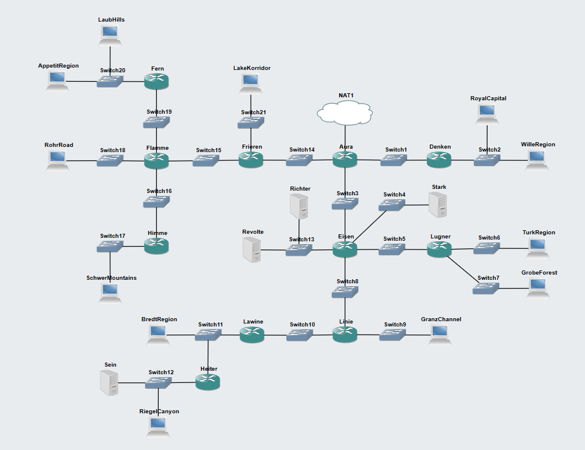
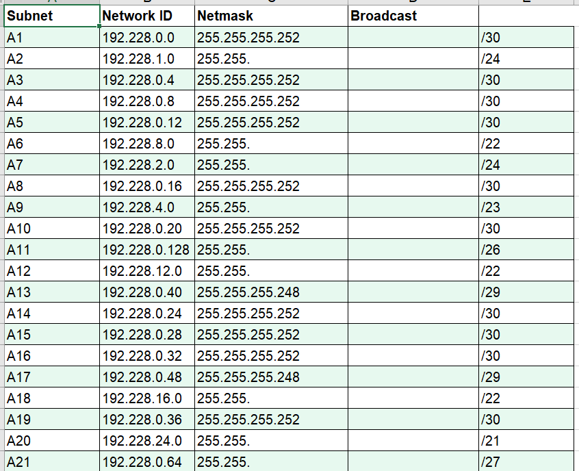
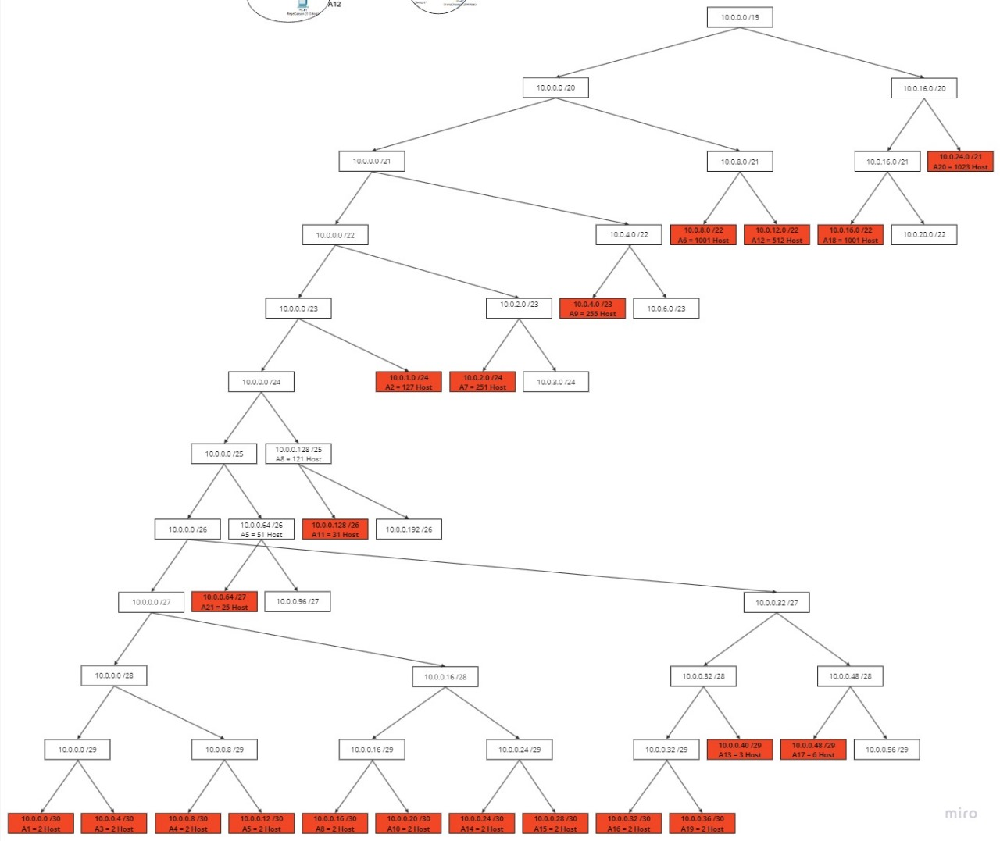
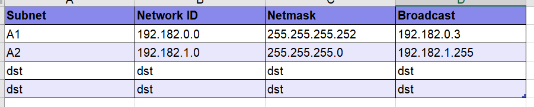

# Jarkom-Modul-4-F10-2023
Laporan resmi praktikum modul 4 subnetting &amp; routing mata kuliah jaringan komputer

# Anggota
Kelompok: F14
Nama | NRP
--- | ---
Ali Hasyimi Assegaf | 5025211131

# Daftar Isi
- [Soal](#soal)
- [Pembagian Subnet](#pembagian-subnet)
- [Konfigurasi VLSM](#konfigurasi-vlsm)
  - [Router](#router)
  - [Endpoint](#endpoint)
  - [Routing](#routing)
- [CIDR](#konfigurasi-cidr)

# Soal

1. Soal shift dikerjakan pada Cisco Packet Tracer dan GNS3 menggunakan metode perhitungan CLASSLESS yang berbeda.
	<br>Keterangan: Bila di CPT menggunakan VLSM, maka di GNS3 menggunakan CIDR atau sebaliknya
2. Jika tidak ada pemberitahuan revisi soal dari asisten, berarti semua soal BERSIFAT BENAR dan DAPAT DIKERJAKAN.
3. Untuk di GNS3 CLOUD merupakan NAT1 jangan sampai salah agar bisa terkoneksi internet.
4. Pembagian IP menggunakan Prefix IP yang telah ditentukan pada modul pengenalan
5. Pembagian IP dan routing harus SE-EFISIEN MUNGKIN.

# Pembagian Subnet
Sebelum melakukan pembagian IP dengan menggunakan metode perhitungan Classless, perlu dilakukan pembagian dan penamaan subnet terlebih dahulu. Penamaan dilakukan dengan tujuan untuk mempermudah melakukan perhitungan. Berikut pembagian dan penamaan subnet yang menjadi dasar perhitungan VLSM dan CIDR:


# Konfigurasi VLSM



## Router
### Aura
```
auto eth0
iface eth0 inet dhcp

# ke Denken
auto eth1
iface eth1 inet static
	address 192.228.0.37
	netmask 255.255.255.252

# ke Frieren
auto eth2
iface eth2 inet static
	address 192.228.0.1
	netmask 255.255.255.252

# ke Eisen
auto eth3
iface eth3 inet static
	address 192.228.0.17
	netmask 255.255.255.252
```

### Denken
```
# ke Aura
auto eth0
iface eth0 inet static
	address 192.228.0.38
	netmask 255.255.255.252
	gateway 192.228.0.37
    
# ke Switch2
auto eth1
iface eth1 inet static
	address 192.228.1.1
	netmask 255.255.255.0
```

### Frieren
```
# ke Aura
auto eth0
iface eth0 inet static
	address 192.228.0.2
	netmask 255.255.255.252
	gateway 192.228.0.1
    
# ke Switch3
auto eth1
iface eth1 inet static
	address 192.228.0.65
	netmask 255.255.255.224
    
# ke Flamme
auto eth2
iface eth2 inet static
	address 192.228.0.5
	netmask 255.255.255.252
```

### Flamme
```
# ke Frieren
auto eth0
iface eth0 inet static
	address 192.228.0.6
	netmask 255.255.255.252
	gateway 192.228.0.5
    
# ke Fern
auto eth1
iface eth1 inet static
	address 192.228.0.9
	netmask 255.255.255.252
    
# ke Switch5
auto eth2
iface eth2 inet static
	address 192.228.16.1
	netmask 255.255.252.0
    
# ke Himmel
auto eth3
iface eth3 inet static
	address 192.228.0.13
	netmask 255.255.255.252
```

### Fern
```
# ke Flamme
auto eth0
iface eth0 inet static
	address 192.228.0.10
	netmask 255.255.255.252
	gateway 192.228.0.9
    
# ke Switch4
auto eth1
iface eth1 inet static
	address 192.228.24.1
	netmask 255.255.248.0
```

### Himmel
```
# ke Flamme
auto eth0
iface eth0 inet static
	address 192.228.0.14
	netmask 255.255.255.252
	gateway 192.228.0.13
    
# ke Switch6
auto eth1
iface eth1 inet static
	address 192.228.0.49
	netmask 255.255.255.248
```

### Eisen
```
# ke Aura
auto eth0
iface eth0 inet static
	address 192.228.0.18
	netmask 255.255.255.252
	gateway 192.228.0.17

# ke Switch1
auto eth1
iface eth1 inet static
	address 192.228.0.41
	netmask 255.255.255.248

# ke Switch0
auto eth2
iface eth2 inet static
	address 192.228.0.33
	netmask 255.255.255.252

# ke Lugner
auto eth3
iface eth3 inet static
	address 192.228.0.29
	netmask 255.255.255.252

# ke Linie
auto eth4
iface eth4 inet static
	address 192.228.0.21
	netmask 255.255.255.252
```

### Lugner
```
# ke Eisen
auto eth0
iface eth0 inet static
	address 192.228.0.30
	netmask 255.255.255.252
	gateway 192.228.0.29
    
# ke Switch10
auto eth1
iface eth1 inet static
	address 192.228.12.1
	netmask 255.255.255.0
    
# ke Switch9
auto eth2
iface eth2 inet static
	address 192.228.2.1
	netmask 255.255.255.0
```

### Linie
```
# ke Eisen
auto eth0
iface eth0 inet static
	address 192.228.0.22
	netmask 255.255.255.252
	gateway 192.228.0.21
    
# ke Switch11
auto eth1
iface eth1 inet static
	address 192.228.4.1
	netmask 255.255.254.0
    
# ke Lawine
auto eth2
iface eth2 inet static
	address 192.228.0.25
	netmask 255.255.255.252
```

### Lawine
```
# ke Linie
auto eth0
iface eth0 inet static
	address 192.228.0.26
	netmask 255.255.255.252
	gateway 192.228.0.25
    
# ke Heiter
auto eth1
iface eth1 inet static
	address 192.228.0.129
	netmask 255.255.255.192
```

### Heiter
```
# ke Lawine
auto eth0
iface eth0 inet static
	address 192.228.0.130
	netmask 255.255.255.192
	gateway 192.228.0.129
    
# ke Switch8
auto eth1
iface eth1 inet static
	address 192.228.8.1
	netmask 255.255.252.0
```

## Endpoint
### RoyalCapital
```
auto eth0
iface eth0 inet static
	address 192.228.1.2
	netmask 255.255.255.0
	gateway 192.228.1.1
    up echo nameserver 192.168.122.1 > /etc/resolv.conf
```

### WilleRegion
```
auto eth0
iface eth0 inet static
	address 192.228.1.3
	netmask 255.255.255.0
	gateway 192.228.1.1
    up echo nameserver 192.168.122.1 > /etc/resolv.conf
```

### LakeKorridor
```
auto eth0
iface eth0 inet static
	address 192.228.0.66
	netmask 255.255.255.224
	gateway 192.228.0.65
    up echo nameserver 192.168.122.1 > /etc/resolv.conf
```

### LaubHills
```
auto eth0
iface eth0 inet static
	address 192.228.24.2
	netmask 255.255.248.0
	gateway 192.228.24.1
    up echo nameserver 192.168.122.1 > /etc/resolv.conf
```

### AppetitRegion
```
auto eth0
iface eth0 inet static
	address 192.228.24.3
	netmask 255.255.248.0
	gateway 192.228.24.1
    up echo nameserver 192.168.122.1 > /etc/resolv.conf
```

### RohrRoad
```
auto eth0
iface eth0 inet static
	address 192.228.16.2
	netmask 255.255.252.0
	gateway 192.228.16.1
    up echo nameserver 192.168.122.1 > /etc/resolv.conf
```

### SchwerMountains
```
auto eth0
iface eth0 inet static
	address 192.228.0.50
	netmask 255.255.255.248
	gateway 192.228.0.49
    up echo nameserver 192.168.122.1 > /etc/resolv.conf
```

### Richter
```
auto eth0
iface eth0 inet static
	address 192.228.0.42
	netmask 255.255.255.248
	gateway 192.228.0.41
    up echo nameserver 192.168.122.1 > /etc/resolv.conf
```

### Revolte
```
auto eth0
iface eth0 inet static
	address 192.228.0.43
	netmask 255.255.255.248
	gateway 192.228.0.41
    up echo nameserver 192.168.122.1 > /etc/resolv.conf
```

### Stark
```
auto eth0
iface eth0 inet static
	address 192.228.0.34
	netmask 255.255.255.252
	gateway 192.228.0.33
    up echo nameserver 192.168.122.1 > /etc/resolv.conf
```

### TurkRegion
```
auto eth0
iface eth0 inet static
	address 192.228.12.2
	netmask 255.255.255.0
	gateway 192.228.12.1
    up echo nameserver 192.168.122.1 > /etc/resolv.conf
```

### GrobeForest
```
auto eth0
iface eth0 inet static
	address 192.228.2.2
	netmask 255.255.255.0
	gateway 192.228.2.1
    up echo nameserver 192.168.122.1 > /etc/resolv.conf
```

### GranzChannel
```
auto eth0
iface eth0 inet static
	address 192.228.2.2
	netmask 255.255.254.0
	gateway 192.228.4.1
    up echo nameserver 192.168.122.1 > /etc/resolv.conf
```

### BredtRegion
```
auto eth0
iface eth0 inet static
	address 192.228.0.131
	netmask 255.255.255.192
	gateway 192.228.0.129
    up echo nameserver 192.168.122.1 > /etc/resolv.conf

auto br0
iface br0 inet static
    address 192.228.0.130
    netmask 255.255.255.192
    gateway 192.228.0.130
    up echo nameserver 192.168.122.1 > /etc/resolv.conf
    bridge_ports eth0
```

### RiegelCanyon
```
auto eth0
iface eth0 inet static
	address 192.228.8.2
	netmask 255.255.252.0
	gateway 192.228.8.1
    up echo nameserver 192.168.122.1 > /etc/resolv.conf
```

### Sein
```
auto eth0
iface eth0 inet static
	address 192.228.8.3
	netmask 255.255.252.0
	gateway 192.228.8.1
    up echo nameserver 192.168.122.1 > /etc/resolv.conf
```

## Routing
### Aura
```
# A1
route add -net 192.228.0.0 netmask 255.255.255.252 gw 192.228.0.2
# A2
route add -net 192.228.0.64 netmask 255.255.255.224 gw 192.228.0.2
# A3
route add -net 192.228.0.4 netmask 255.255.255.252 gw 192.228.0.2
# A4
route add -net 192.228.0.8 netmask 255.255.255.252 gw 192.228.0.2
# A5
route add -net 192.228.24.0 netmask 255.255.248.0 gw 192.228.0.2
# A6
route add -net 192.228.16.0 netmask 255.255.252.0 gw 192.228.0.2
# A7
route add -net 192.228.0.12 netmask 255.255.255.252 gw 192.228.0.2
# A8
route add -net 192.228.0.48 netmask 255.255.255.248 gw 192.228.0.2
# A9
route add -net 192.228.0.16 netmask 255.255.255.252 gw address 192.228.0.18
# A10
route add -net 192.228.0.40 netmask 255.255.255.248 gw address 192.228.0.18
# A11
route add -net 192.228.0.20 netmask 255.255.255.252 gw address 192.228.0.18
# A12
route add -net 192.228.0.24 netmask 255.255.255.252 gw address 192.228.0.18
# A13
route add -net 192.228.0.128 netmask 255.255.255.192 gw address 192.228.0.18
# A14
route add -net 192.228.8.0 netmask 255.255.252.0 gw address 192.228.0.18
# A15
route add -net 192.228.4.0 netmask 255.255.254.0 gw address 192.228.0.18
# A16
route add -net 192.228.0.28 netmask 255.255.255.252 gw address 192.228.0.18
# A17
route add -net 192.228.2.0 netmask 255.255.255.0 gw address 192.228.0.18
# A18
route add -net 192.228.12.0 netmask 255.255.252.0 gw address 192.228.0.18
# A19
route add -net 192.228.0.32 netmask 255.255.255.252 gw 192.228.0.38
# A20
route add -net 192.228.0.36 netmask 255.255.255.252 gw 192.228.0.38
# A21
route add -net 192.228.1.0 netmask 255.255.255.0 gw 192.228.0.38
```

### Denken
```
route add -net 0.0.0.0 netmask 0.0.0.0 gw 192.228.0.37
```

### Frieren
```
route add -net 0.0.0.0 netmask 0.0.0.0 gw 192.228.0.1

# A3
route add -net 192.228.0.4 netmask 255.255.255.252 gw 192.228.0.6
# A4
route add -net 192.228.0.8 netmask 255.255.255.252 gw 192.228.0.6
# A5
route add -net 192.228.24.0 netmask 255.255.248.0 gw 192.228.0.6
# A6
route add -net 192.228.16.0 netmask 255.255.252.0 gw 192.228.0.6
# A7
route add -net 192.228.0.12 netmask 255.255.255.252 gw 192.228.0.6
# A8
route add -net 192.228.0.48 netmask 255.255.255.248 gw 192.228.0.6
```

### Flamme
```
route add -net 0.0.0.0 netmask 0.0.0.0 gw 192.228.0.5

# A4
route add -net 192.228.0.8 netmask 255.255.255.252 gw 192.228.0.10
# A5
route add -net 192.228.24.0 netmask 255.255.248.0 gw 192.228.0.10
# A7
route add -net 192.228.0.12 netmask 255.255.255.252 gw 192.228.0.14
# A8
route add -net 192.228.0.48 netmask 255.255.255.248 gw 192.228.0.14
```

### Fern
```
route add -net 0.0.0.0 netmask 0.0.0.0 gw 192.228.0.9
```

### Himmel
```
route add -net 0.0.0.0 netmask 0.0.0.0 gw 192.228.0.13
```

### Eisen
```
route add -net 0.0.0.0 netmask 0.0.0.0 gw 192.228.0.17

# A16
route add -net 192.228.0.28 netmask 255.255.255.252 gw 192.228.0.30
# A17
route add -net 192.228.2.0 netmask 255.255.255.0 gw 192.228.0.30
# A18
route add -net 192.228.12.0 netmask 255.255.252.0 gw 192.228.0.30
# A11
route add -net 192.228.0.20 netmask 255.255.255.252 gw 192.228.0.22
# A12
route add -net 192.228.0.24 netmask 255.255.255.252 gw 192.228.0.22
# A15
route add -net 192.228.4.0 netmask 255.255.254.0 gw 192.228.0.22
# A13
route add -net 192.228.0.128 netmask 255.255.255.192 gw 192.228.0.22
# A14
route add -net 192.228.8.0 netmask 255.255.252.0 gw 192.228.0.22
```

### Lugner
```
route add -net 0.0.0.0 netmask 0.0.0.0 gw 192.228.0.29
```

### Linie
```
route add -net 0.0.0.0 netmask 0.0.0.0 gw 192.228.0.21

# A12
route add -net 192.228.0.24 netmask 255.255.255.252 gw 192.228.0.26
# A13
route add -net 192.228.0.128 netmask 255.255.255.192 gw 192.228.0.26
# A14
route add -net 192.228.8.0 netmask 255.255.252.0 gw 192.228.0.26
```

### Lawine
```
route add -net 0.0.0.0 netmask 0.0.0.0 gw 192.228.0.25

# A13
route add -net 192.228.0.128 netmask 255.255.255.192 gw 192.228.0.130
# A14
route add -net 192.228.8.0 netmask 255.255.252.0 gw 192.228.0.130
```

### Heiter
```
route add -net 0.0.0.0 netmask 0.0.0.0 gw 192.228.0.129
```

# Konfigurasi CIDR

## Subnetting
Pada metode CIDR, pembagian IP untuk tiap subnet dilakukan dengan menggabungkan subnet terjauh dari router yang terhubung ke NAT (Aura) dengan subnet sebelahnya. Penggabungan dilakukan terus hingga didapatkan 1 subnet besar yang mencakup seluruh subnet yang ada. Proses penggabungan subnet ini dapat dilihat dari tabel berikut:

I. <br><br>


Dari proses penggabungan subnet di atas, perhitungan IP kemudian dilakukan dengan membuat pohon IP yang rootnya merupakan IP untuk subnet terbesar. Karena subnet terbesar menggunakan netmask /16, maka IP pada root tree adalah `192.228.0.0 /16`. Selanjutnya root dipecah menjadi 2 berdasarkan subnet gabungannya. Karena subnet besar merupakan gabungan 2 subnet dengan netmask /17, maka root dipecah menjadi 2 node dengan IP `192.228.0.0 /17` dan `192.228.128.0 /17`. Proses ini dilakukan hingga tiap subnet kecil mendapatkan IP.

IP tiap subnet dapat dilihat lebih detail di tabel berikut: <br>

